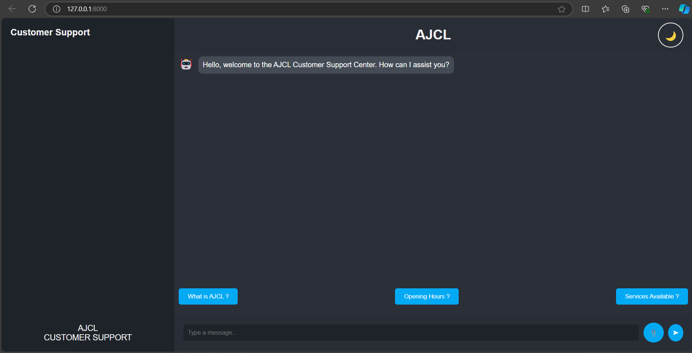
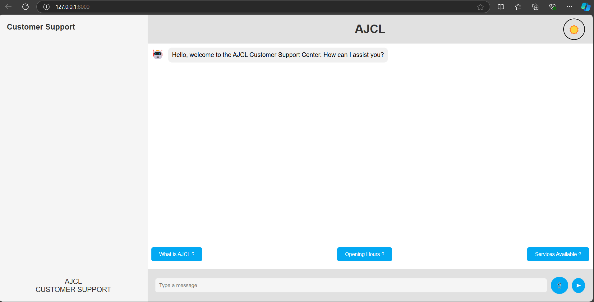
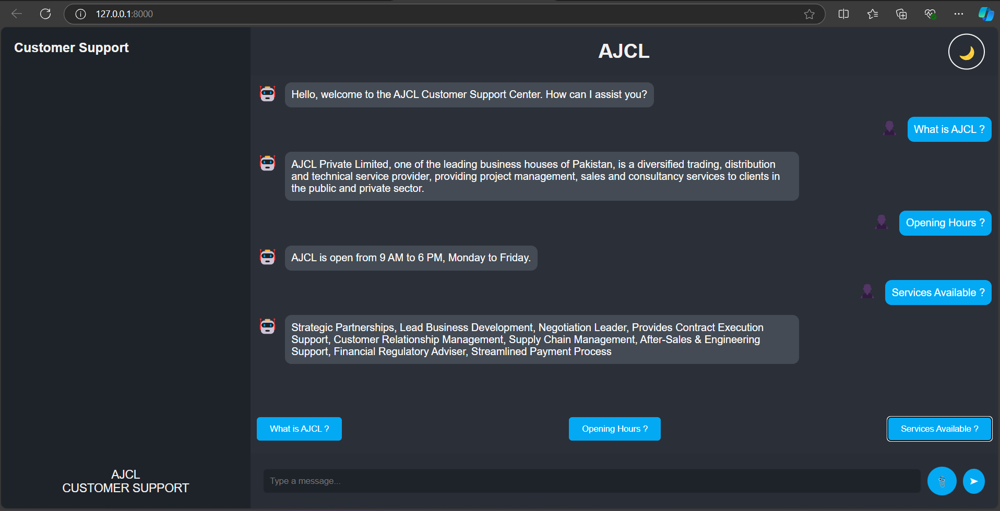
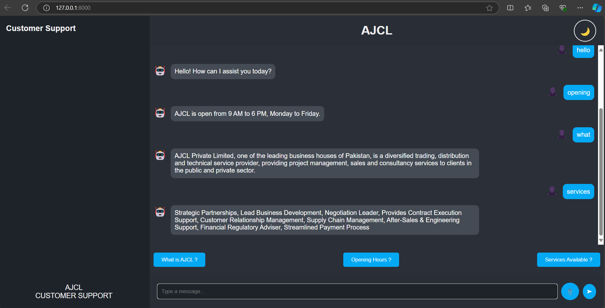
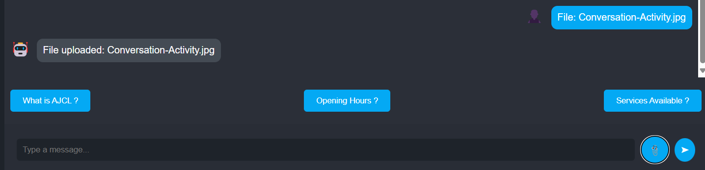
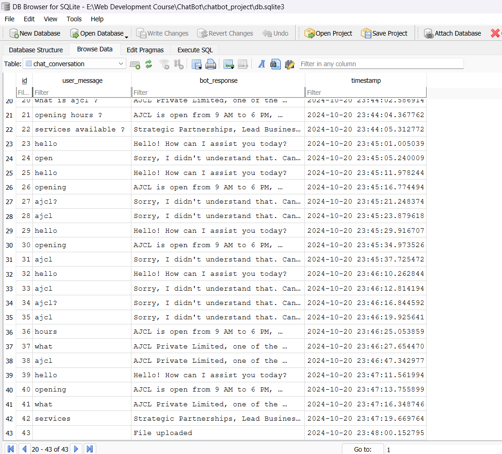
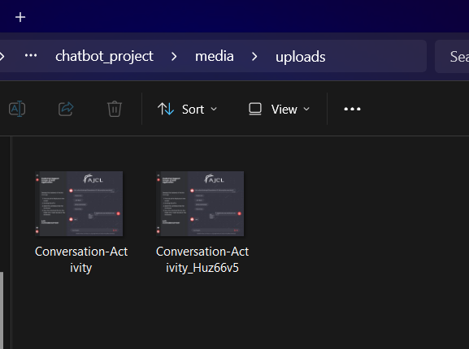

# Chatbot Web Application Setup Guide

## Introduction

This project is a Django-based chatbot web application that allows users to interact with a chatbot, switch between dark and light modes, and upload files. The bot provides predefined responses to user queries.

In this guide, you'll learn how to set up and run this project locally after cloning it from GitHub.

## Steps to Set Up the Project

### 1. Clone the Repository

To get started, clone the repository from GitHub using the following command:

```
git clone {link}
cd ChatBot
cd chatbot_project
```

### 2. Set Up the Database
You’ll need to set up the database. Django will handle the database migrations for you:

```
python manage.py migrate
```

If you want access to the Django admin interface, create a superuser by running:

```
python manage.py createsuperuser
```

### 3. Run the App
Run the App using the following command in the terminal:

```
python manage.py runserver
```

### 4. Some ScreenShots of the Working App: 

Dark Mode:



Light Mode:



Predefined Questions (the question cards/buttons on the bottom) with Responses From Backend/ChatBot:



Other Questions and Their Responses:



Uploading a File:



Conversation Stored in the Database:



Uploaded Files Stored in a Folder:


